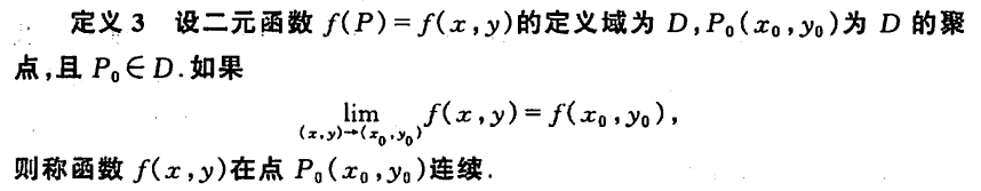
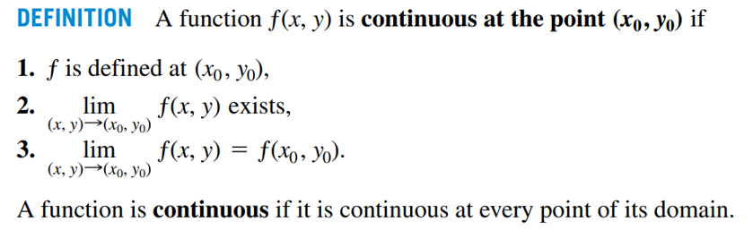

# 多元函数连续，可微，偏导存在，偏导连续关系证明与总结

笔者最近在学习多元函数连续，可微，偏导存在，偏导连续之间的关系时，发现中英文书对于部分以上概念的定义有所不同。 这导致一些中文书（**同济大学高等数学第六版**）上成立的关系，根据英文书（**Thomas Calculus 13th Edition**）的定义未必成立。 本文将对中英文书的定义进行比较，并分别根据两本教材的定义对多元函数连续，可微，偏导存在，偏导连续之间的关系进行总结，内容如有错误，欢迎指正。

[TOC]

## 背景

关于我为什么会发现两本教材的定义不同，得从一张图片说起

这是一张我以前高数老师的课件里的图片，之前一直没觉得这张图有什么问题，直到我看到了这个函数

根据关系图，函数偏导数连续可以推出函数可微。这个函数的偏导数在原点都是连续的
$$
f_x=0, 定义域= \begin{cases} x\in(-\infin,\infin) \\ y = 0\end{cases}\\
f_y=0, 定义域= \begin{cases} y\in(-\infin,\infin) \\ x = 0\end{cases}
$$
但是这个函数在原点是不可微的，因为连续是可微的前提条件，这个函数在原点不连续，那么它一定不可微（后面会有证明）。那这是不是和关系图矛盾了吗？在一次互助课堂上，我了解到今年还有老师在用这个关系图，因此我觉得这个图有错的概率不大，所以我决定到教材里看看是怎么回事。

## 定义比较

### 连续

对于多元函数连续性的定义，中文书和英文书上是基本一样的。在中文书在定义连续的时候引入了聚点的概念，这个概念在中文第53页有定义，对于引入聚点的原因可以参考[这篇文章](https://www.zhihu.com/question/31790726)。

**中文书：**

**英文书：**

### 偏导数

两本教材都用到了极限来定义偏导数，中文书的定义里多了一句

> 设函数 $z=f(x,y)$ 在点 $(x_0,y_0)$ 的某一邻域内有定义

但这个应该是英文书的隐含条件，不然 $f(x_0+h,y_0)$  就没有定义了。

**中文书：**

**英文书：**

### 可微

**中文书：**

**英文书：**

两本教材对于可微的定义乍一看有很大的不同（中文书里的 $o(\rho)$ 在英文书里变成了 $\epsilon_1\Delta x+\epsilon_2\Delta y$ ），但其实可以由英文书定义推出中文书定义，因此我认为在可微的定义上，**英文书定义的范围更广**，证明如下：
$$
因为\left| \epsilon_1\Delta x+\epsilon_2\Delta y \right|
\le
\left| \epsilon_1 \sqrt{\Delta x^2 +\Delta y^2 }+\epsilon_2\sqrt{\Delta x^2 +\Delta y^2 } \right|\\\\

根据\rho=\sqrt{\Delta x^2 +\Delta y^2 }，可得\left| \epsilon_1\Delta x+\epsilon_2\Delta y \right|
\le
\left| (\epsilon_1+\epsilon_2)\rho  \right|\\\\

所以\left| \frac{\epsilon_1\Delta x+\epsilon_2\Delta y}{\rho} \right|
\le
\left|  \epsilon_1+\epsilon_2\right|\\\\

根据定义，当\Delta x\to0,\Delta y\to0时,\rho\to0,\epsilon_1\to0,\epsilon_2\to0\\\\
故， \epsilon_1\Delta x+\epsilon_2\Delta y为\rho的高阶无穷小量，即\epsilon_1\Delta x+\epsilon_2\Delta y=o(\rho)
$$

## 关系证明

### 连续 $\nRightarrow $偏导存在

反例：

$f(x,y)=\sqrt{(x^2+y^2)}$

该函数在原点连续但偏导不存在，它的图像长这样

### 偏导存在$\nRightarrow $连续

反例：

该函数在原点不连续但偏导存在

### 连续$\nRightarrow $可微

反例：

$f(x,y)=\sqrt{(x^2+y^2)}$

偏导存在是可微的前提条件，这个函数偏导不存在所以不可微

### 可微$\Rightarrow $连续

### 偏导存在$\nRightarrow $可微

反例：

还是这个图:sweat_smile:

### 可微$\Rightarrow $偏导存在

根据定义，可微是偏导存在的必要条件，所以函数可微则偏导存在

### 可微$\nRightarrow $偏导连续

反例：

$f(x,y)= \begin{cases} (x^2+y^2)sin\frac{1}{x^2+y^2}, &x^2+y^2\neq0 \\ 0,&x^2+y^2 =0\end{cases}$
$$
根据定义\\\\
当x^2+y^2=0,f_x(0,0)=\lim_{\Delta x\to0} \frac{f(0+\Delta x)-f(0,0)}{\Delta x}=\lim_{\Delta x\to0} \Delta xsin\frac{1}{\Delta x^2}=0\\\\
当x^2+y^2\neq0,f_x(x,y)=2xsin\frac{1}{x^2+y^2}-\frac{2x}{x^2+y^2}cos\frac{1}{x^2+y^2}
\\\\
\lim_{(x,y)\to(0,0)}f_x(x,y)不存在，该函数在原点为震荡不连续点\\\\
\Delta z=f(x,y)-f(0,0)=(\Delta x^2+\Delta y^2)sin\frac{1}{\Delta x^2+\Delta y^2}\\\\
因为f_x(0,0)\Delta x+f_y(0,0)\Delta y=0\\\\
\Delta z-f_x(0,0)\Delta x+f_y(0,0)\Delta y\\\\=(\Delta x^2+\Delta y^2)sin\frac{1}{\Delta x^2+\Delta y^2}=\Delta x^2sin\frac{1}{\Delta x^2+\Delta y^2}+\Delta y^2sin\frac{1}{\Delta x^2+\Delta y^2}\\\\
=\Delta x(\Delta xsin\frac{1}{\Delta x^2+\Delta y^2})+\Delta y(\Delta ysin\frac{1}{\Delta x^2+\Delta y^2})\\\\
当\Delta x\to0,\Delta y\to0时，\Delta xsin\frac{1}{\Delta x^2+\Delta y^2}\to0且\Delta ysin\frac{1}{\Delta x^2+\Delta y^2}\to0\\\\
函数可微
$$

### 偏导连续$\Rightarrow $可微

终于到了揭晓答案的时候了，偏导连续可以推出可微吗？

我们来看看中文书的证明

证明过程中有一个问题，这个证明用到了 $f(y+\Delta y)$ ，然而在我们的反例中 $f(y+\Delta y)$ 是不在定义域内的（因为定义域只包含 $y=0$ 的点）。难道中文书证明错了？？？

**NO！**观察仔细的同学会发现中文书第72页小字写道

> 多元函数的偏导数在一点连续是指：偏导数在该点的某个邻域内存在

噢，根据这个定义，偏导数必须在原点附近的邻域内存在，而原函数在原点附近的邻域是不止包含 $y=0$ 的点的，所以不满足偏导连续的条件。自然也就无法推出函数可微了。

## 结论

根据英文书第820页推论

> **COROLLARY OF THEOREM 3** If the partial derivatives $f_x$ and $f_y$ of a function  $f(x,y)$ are continuous throughout an open region $R$, then $f(x,y)$ is differentiable at every point of $R$

偏导数如果在一点的**邻域内**连续，则函数在该领域内**处处可微**。

所以，为了减少误解，我们还是把关系图改成这样吧！

